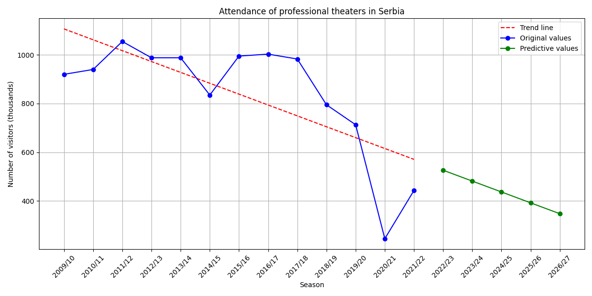

# Yearly attendance of theaters in Serbia

This is a data science project that predicts and visualizes the yearly attendance of theaters in Serbia.
The Python program processes JSON data and creates a relevant dataset with seasons and their attendance values.
The dataset is stored in a Firestore database and used for predicting attendance using Linear Regression.

**Data source**: https://opendata.stat.gov.rs/odata/?id=sr-lat