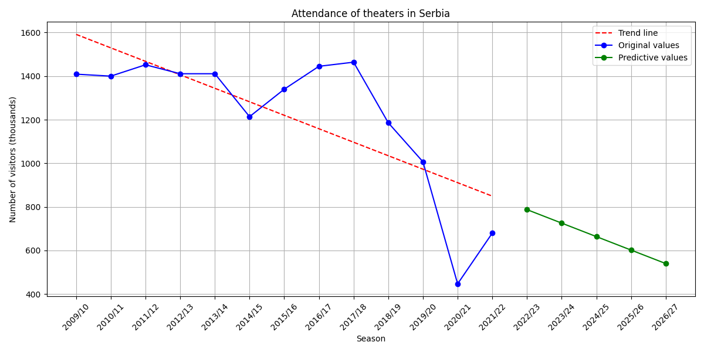

# Yearly attendance of theaters in Serbia

This is a data science project that predicts and visualizes the yearly attendance of theaters in Serbia.
The Python program processes JSON data, creates a relevant DataFrame with seasons and their attendance values, saves the DataFrame to a FireStore database and fetches the data from the database.
The fetched data is then used for predicting attendance using Linear Regression.

**Data source**: https://opendata.stat.gov.rs/odata/?id=sr-lat